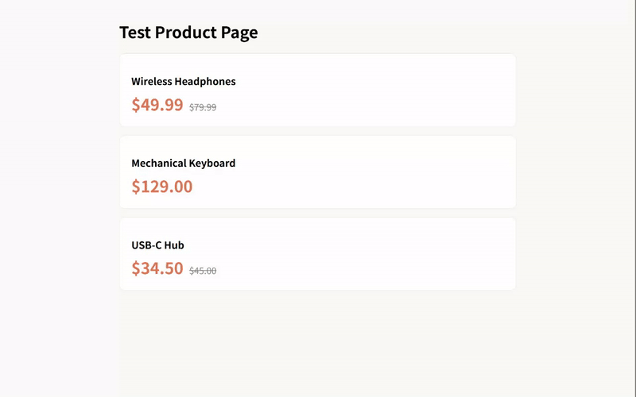

# 💰 Price Watch

Chrome extension to monitor product prices on any page. Pick a price element, get webhook alerts when it changes.

**Built in ~2 hours.** Stack: Manifest V3 + Service Worker + chrome.storage.

## 🎬 Demo



## 🛠 How it works

| Step | Action |
|------|--------|
| 1 | Open any product page (Amazon, eBay, Vevor, etc.) |
| 2 | Click the Price Watch icon → "Pick Price Element" |
| 3 | Click on any price number on the page |
| 4 | Extension stores the CSS selector + URL |
| 5 | Every 15 min, it checks if the price changed >1% |
| 6 | Price change → browser notification + webhook |

## 📦 Tech

- **Manifest V3**
- **Service Worker** — `background.js` (alarms, notifications, webhook)
- **Content Script** — `content.js` (element picker, CSS selector builder, price reader)
- **Popup UI** — `popup.html` + `popup.js` (target manager, webhook config)
- **chrome.storage** — persists targets and webhook URL
- **chrome.alarms** — periodic price checks
- **chrome.notifications** — native OS notifications

## 🧪 Tests

```bash
node test-runner.mjs
```

```
✅ Found 3 price elements
✅ Price read: $49.99 → 49.99
✅ Picker selector → 3 matches
✅ All prices correct
✅ Price change detection: -20% drop, same, +10% rise
✅ All 6 extension files present
✅ Manifest V3: Price Watch v0.1.0
```

## 📂 Files

```
price-watch/
├── manifest.json      Manifest V3 config
├── background.js      Service worker (alarms + webhook + notifications)
├── content.js         Element picker + CSS selector builder + price reader
├── popup.html         Extension popup UI
├── popup.js           Popup logic (target CRUD, webhook config)
├── picker.css         Element picker styling
├── test.html          Test product page
├── test-runner.mjs    Playwright E2E test (6/6)
└── icons/             Extension icons
```

## 🚀 Install

1. Open `edge://extensions` (or `chrome://extensions`)
2. Enable **Developer mode**
3. Click **Load unpacked** → select this folder
4. Open any product page and try it

## 👷 Built in Public

Part of my [build-in-public journey](https://x.com/LiaoLeonar47885) — shipping small products and documenting everything.
